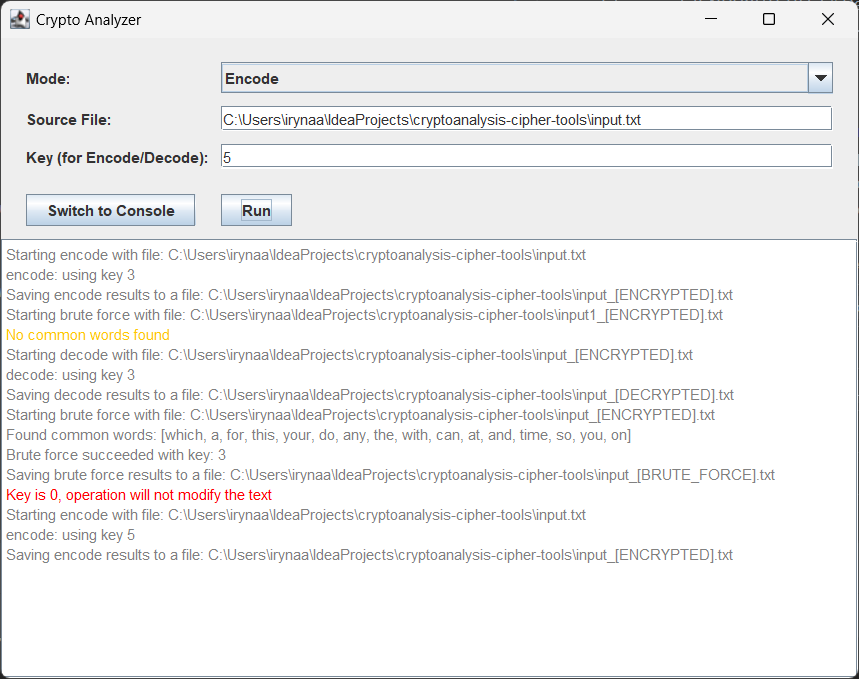
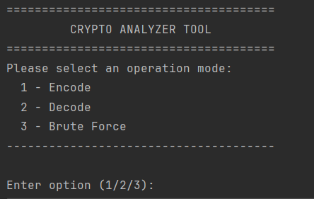

<div style="text-align: center;">
  <h1>Crypto Analyzer Tool</h1>

  <p style="max-width: 700px; margin: auto;">
    This is a simple demo project built with Java that demonstrates Caesar cipher encryption, decryption,
    and brute-force analysis of text files. It features both GUI and console modes and is intended for
    learning and experimenting with basic cryptographic concepts.
  </p>

<br><br>

</div>


## Technologies stack
[](https://shields.io/)
[](https://shields.io/)
[](https://shields.io/)
[](https://junit.org/junit5/)
[](http://logback.qos.ch/)

## Usage
Run the application using one of the options below:

### 1. Run the GUI
1. Clone the repository:
```bash
git clone https://github.com/iryna-aharahimova/cryptanalysis-cipher-tools.git
cd cryptoanalysis-cipher-tools
```
2. Run from source:
   - Launch EntryPoint.java in your IDE, OR
   - Use terminal:
```bash 
java -jar target/cryptoanalysis-cipher-tools-1.0-SNAPSHOT-jar-with-dependencies.jar
```

### 2. Run in Console Mode
```bash
java -jar target/cryptoanalysis-cipher-tools-1.0-SNAPSHOT-jar-with-dependencies.jar [mode] [input_file] [key]
```

| Mode | Name        | Description                       | Key Required |
| ---- | ----------- | --------------------------------- | ------------ |
| 1    | Encode      | Caesar cipher encryption          | ✅            |
| 2    | Decode      | Caesar cipher decryption          | ✅            |
| 3    | Brute Force | Attempts to decrypt without a key | ❌            |


## Examples:
### Encode a file with key 5:

```bash
java -jar cryptoanalysis-cipher-tools-1.0-SNAPSHOT-jar-with-dependencies.jar 1 input_[ENCRYPTED].txt 5
```
### Brute-force decrypt:

```bash
java -jar cryptoanalysis-cipher-tools-1.0-SNAPSHOT-jar-with-dependencies.jar 3 input_[ENCRYPTED].txt
```
## File Structure
<pre>
cryptoanalysis-cipher-tools/
│
├── input.txt                                      # Default input file (plain text)
├── input_[ENCRYPTED].txt                          # Encrypted input file
├── input_[DECRYPTED] or input_[BRUTE_FORCE].txt   # Decryption result
├── logs/                                          # Logs with timestamps
│   └── yyyy-MM-dd_HH-mm.log
├── target/                                        # Compiled jar file
│   └── cryptoanalysis-cipher-tools-1.0-SNAPSHOT-jar-with-dependencies.jar
└── ...
</pre>

### Build from Source
To build the project manually:

```bash 
mvn clean package
``` 

The compiled JAR will be at: 
`target/cryptoanalysis-cipher-tools-1.0-SNAPSHOT-jar-with-dependencies.jar`
